# islizxBlog
基于SpringMVC+Spring+MyBatis开发的个人博客网站，使用IDEA工具开发，毕业设计
## 一、关于项目

1. 该博客是基于SSM实现的个人博客系统，适合初学SSM和个人博客制作的同学学习。主要技术架构包括Maven、SpringMVC、Spring、MyBatis、Thymeleaf、Redis等。前端采用Bootstarp和Semantic UI。

## 二、使用步骤

1. Fork项目

   fork或者下载项目到本地（建议先fork到自己仓库，在通过码云导入仓库下载，实测下载速度可以）。完整项目源码，可以使用IDEA导入。数据库文件请先创建数据库，然后以运行sql文件方式导入

2. 导入数据库

   新建数据库**blog**,导入数据库blog.sql。注意，数据库的编码和排序规则是utf-8和utf-8_general_ci。数据库默认用户名 root，密码 123456

3. 启动redis服务，并在redis.properties配置你的redis

4. 修改项目中的数据库连接信息

   修改 db.properties 文件，该文件很容易找到，在 src/main/resources 中。里面有 MySQL 数据库连接信息，请确保已安装和启动 MySQL。注意修改数据库地址、表名、用户名和密码。

5. db.properties 文件中databasePath表示每周日进行数据库备份的路径，可自行修改
6. 后台sql文件中管理员账户为admin,密码为：111111

## 三、使用注意

1. 开发工具的选择

   请使用 IntelliJ IDEA, 尽量不要用 Eclipse/MyEclipse。后者可能要折腾一会儿

2. 确保你安装了 Maven(如果maven加载pom报错，发现不是自己配置的maven，请到setting中修改成自己的maven仓库)

3. 本项目有使用到redis，所以运行项目前先启动redis服务，并在redis.properties配置你的redis

4. 请给你的IDE安装Lombok插件

   实体类中多次使用到 @Data 注解，请确保你的 IDE 安装了 Lombok 插件，否则找不到 getter/setter 方法

5. 数据库乱码，在MySQL安装路径，比如（E:\MySQL\MySQL Server 5.5）下找到my.ini文件进入编辑，修改这两处地方为utf8，默认是拉丁文

```xml
character-set-server=utf8
default-character-set=utf8
```

6. 本项目使用到的mail服务可在mail.properties中配置，不配置的话不影响整体，只是使用不了邮件服务。
7. 本项目原本使用的是阿里云oss服务，现已修改成图片上传到本地服务器，如果需要可以在db.properties中进行阿里云配置

## 二、效果预览

1. 预览地址：https://islizx.cn

2. 前台效果图就不展示了，可前往网站浏览

3. 介绍几张后台的页面

   1. 后台首页 DashBoard

      

   2. 文章列表

      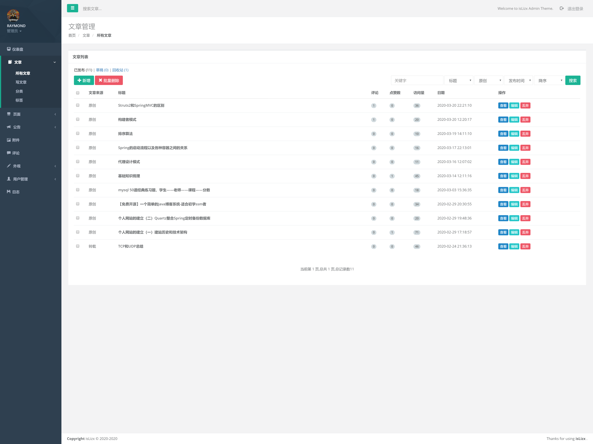

   3. 编辑文章（MarkDown编辑器）

      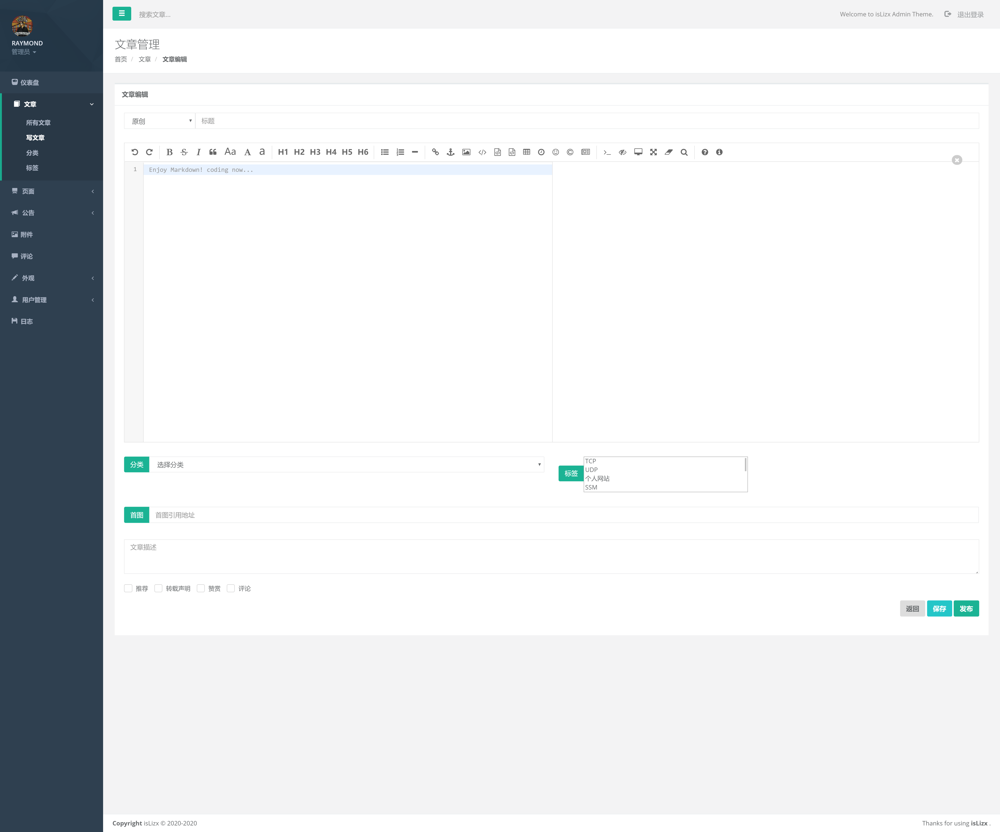

   4. 文章类型管理

      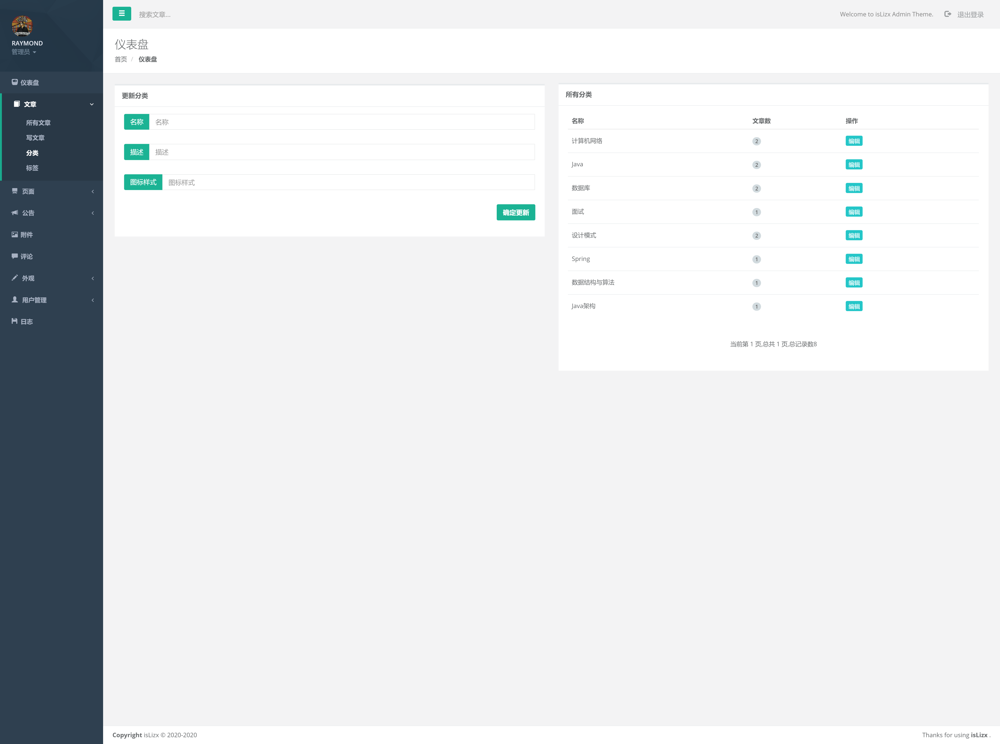

   5. 页面管理（可以自定义页面，申请友链和留言板即为自定义页面）

      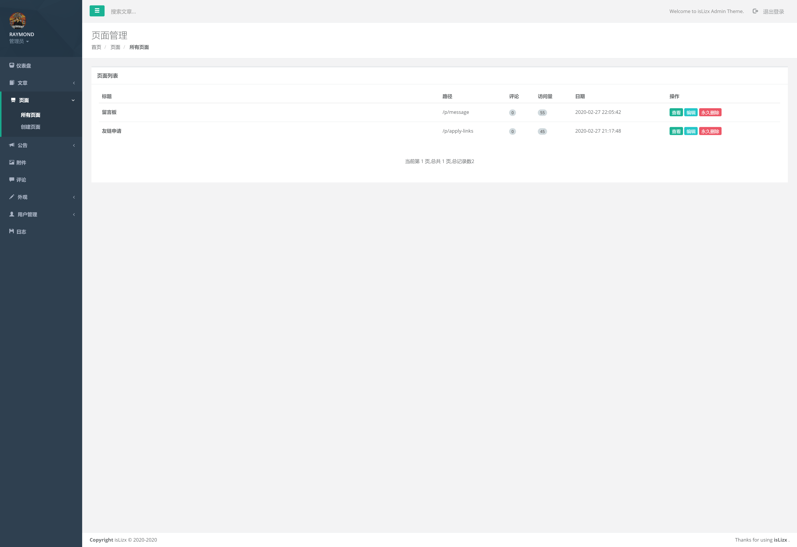

      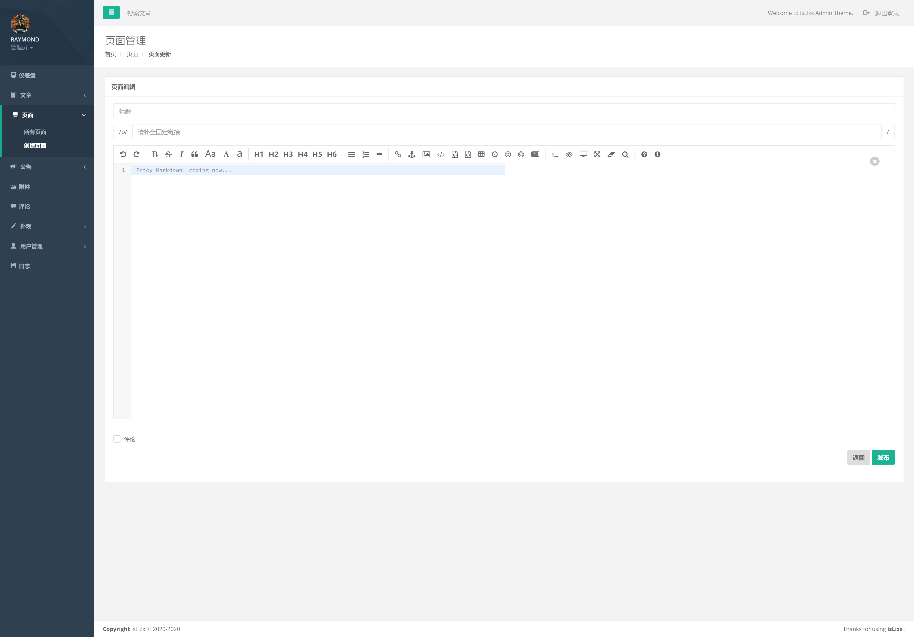

   6. 公告管理

      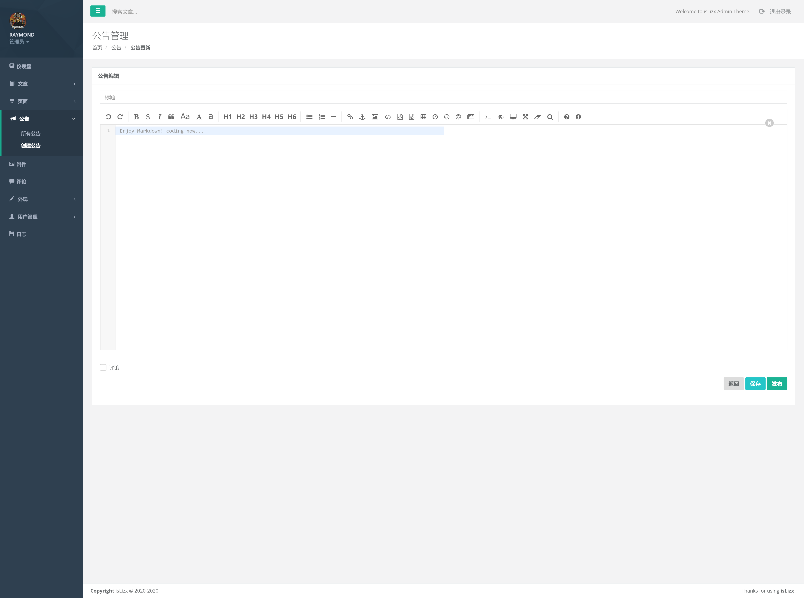

   7. 附件管理（点击附件可以查看详细信息以及删除操作）
   
      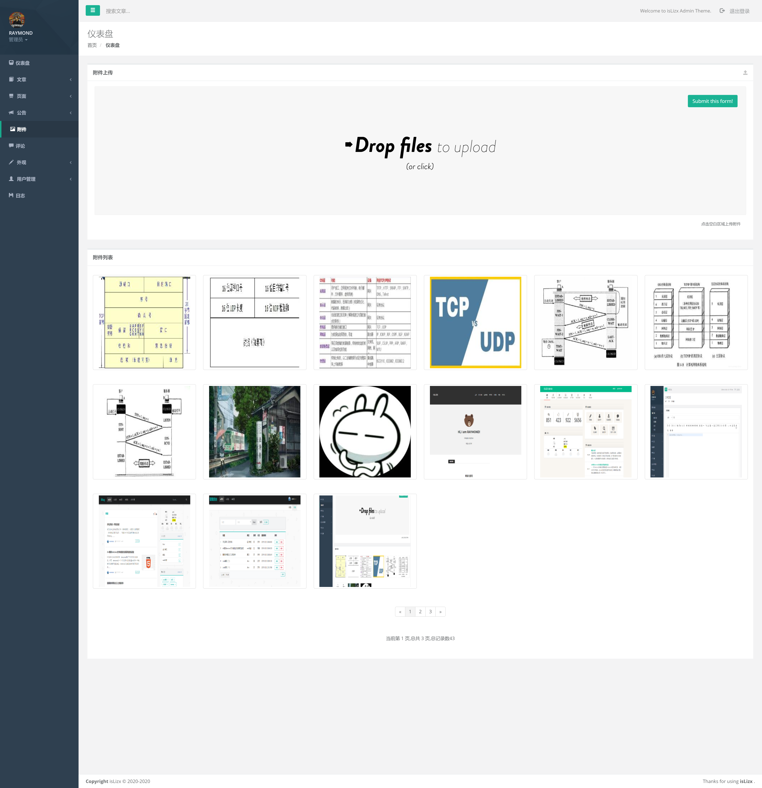
   
      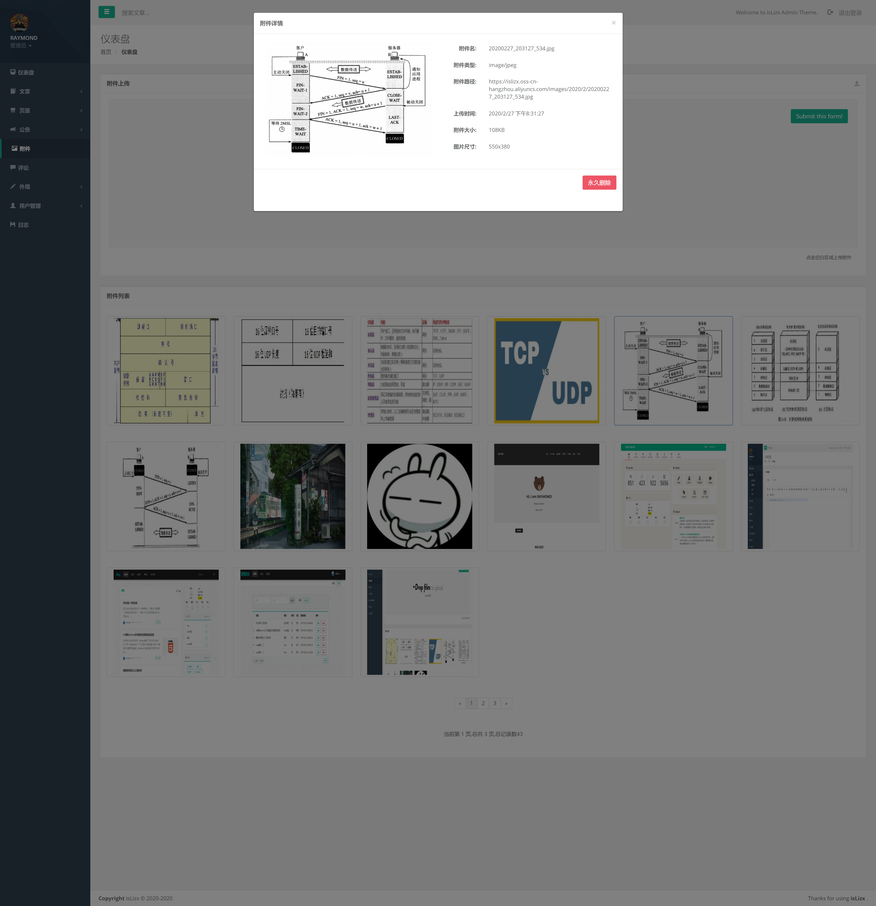
   
   8. 评论管理（管理员回复回收站和待审核的评论后直接通过审核并发送邮件给评论者）
   
      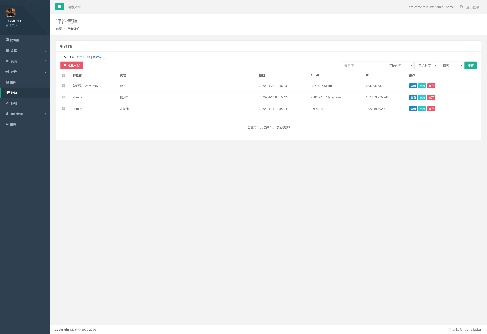
   
   9. 轮播图管理(即首页的轮播图，轮播图可另外链接到其它页面，比如文章或公告)
   
      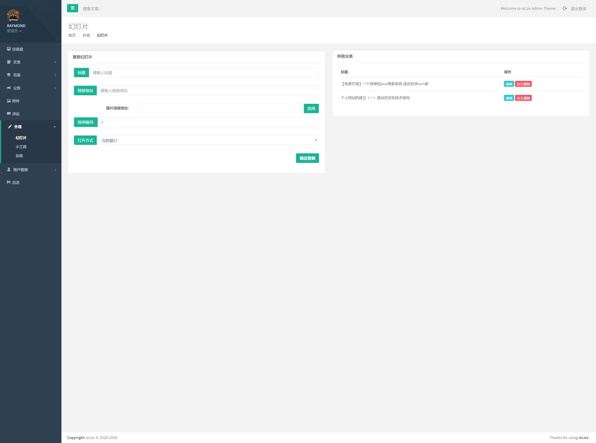
   
   10. 小工具管理（即首页右侧的bar）
   
      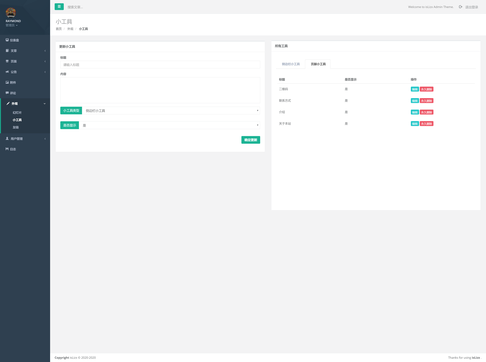
   
   11. 友链管理
   
      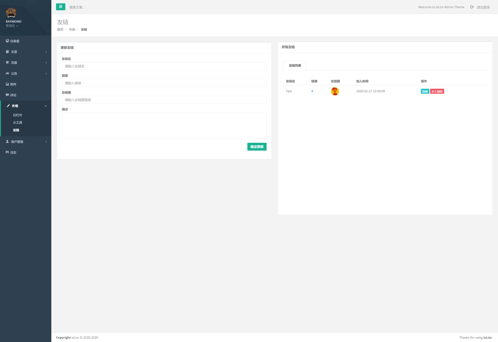
   
   12. 日志管理
   
      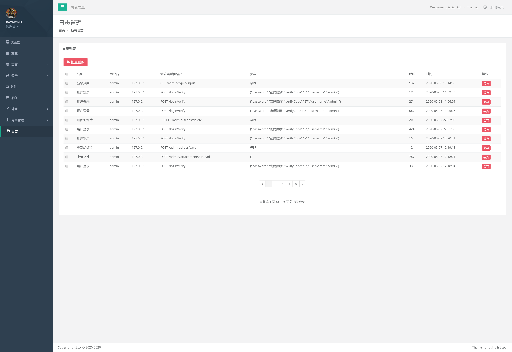

## 五、下载地址

​	GitHub地址：https://github.com/isLizx/islizxBlog  （如果可以帮忙点一次Star和Fork）
